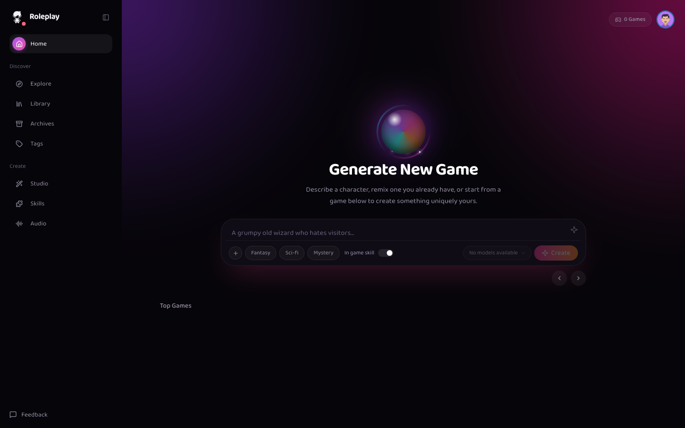

<p align="center">
  
</p>

<p align="center">
  Local, Ollama-powered companion chat with persistent memory.<br>
  No narration, no scene descriptions — just plain first-person chat, like an audio drama between you and the AI.
</p>

<p align="center">
  <a href="https://www.python.org/">
    
  </a>
  <a href="https://nodejs.org/">
    
  </a>
  <a href="https://fastapi.tiangolo.com/">
    
  </a>
  <a href="https://react.dev/">
    
  </a>
  <a href="https://ollama.com/">
    
  </a>
</p>

<p align="center">
  
</p>

## Table of Contents

- [Overview](#overview)
- [Features](#features)
- [Architecture](#architecture)
- [Quickstart](#quickstart)
- [Optional Features](#optional-features)
- [Personas](#personas)
- [Project Structure](#project-structure)
- [Docker](#docker)
- [Development](#development)
- [Documentation](#documentation)
- [Configuration](#configuration)
- [Privacy](#privacy)
- [License](#license)

## Overview

**Roleplay Agent** is a self-hosted character chat application built with **FastAPI, LangGraph, Ollama, SQLite, and React**.

It's designed for direct, in-character conversation with personas — first person, no narration, no scene-setting. Run it entirely on your own machine with local models, or plug in external providers when you need them.

## Features

- **Local-first** — run models locally with Ollama, no cloud dependency required
- **Persistent memory** — personas retain context across sessions
- **Voice mode** — natural, conversational speech with TTS
- **Read aloud** — listen to persona responses instead of reading them
- **Persona builder** — generate and edit characters with AI assistance
- **Skills** — extend personas with tools such as web search and calendar access
- **Transcript import** — build personas from transcripts or YouTube captions
- **Semantic search** — search your conversation history by meaning, not just keywords

## Architecture

```text
┌──────────────────┐
│  React + TS SPA  │
└────────┬─────────┘
         │
         ▼
┌───────────────────────┐
│ FastAPI + LangGraph    │
└───────┬────────┬───────┘
        │        │
        ▼        ▼
   ┌────────┐ ┌────────┐
   │ SQLite │ │ Ollama │
   └────────┘ └────────┘
```

## Quickstart

### Requirements

- Python 3.11+
- Node.js 18+
- Ollama
- `ffmpeg` (required for video workflows)

### Install

```bash
git clone https://github.com/amankumawat-567/roleplay-agent.git
cd roleplay-agent

python3 -m venv venv
source venv/bin/activate

make install
ollama pull llama3.1
```

### Run

```bash
make dev
```

Open **[http://localhost:8000](http://localhost:8000)**.

## Optional Features

### Text-to-Speech (TTS)

For Apple Silicon:

```bash
pip install -e ".[tts]"
```

### Whisper Transcription

For videos without usable captions:

```bash
pip install -e ".[transcribe]"
```

## Personas

Personas are configured as YAML character files (referred to internally as "games"):

```text
data/games/<game_id>/game.yaml
```

Start from the template:

```text
data/games/template.yaml.example
```

See [`docs/GAME.md`](docs/GAME.md) for the full schema and options.

## Project Structure

```text
src/roleplay_agent/   Backend
dev-ui/               React frontend
configs/              Application configuration
data/games/           Personas
docs/                 Documentation
scripts/              Utilities
tests/                Unit, API, and integration tests
```

## Docker

```bash
make docker-up
```

The application runs in Docker while Ollama continues running on the host.

## Development

Run the test suite:

```bash
make test
```

Useful commands:

| Command | Description |
|---|---|
| `make dev` | Run the app in development mode |
| `make run` | Run the app |
| `make ui-dev` | Run the frontend in development mode |
| `make ui-build` | Build the frontend for production |
| `make seed-games` | Seed sample personas |
| `make research GAME=<game_id>` | Run research for a given persona |
| `make cleanup` | Clean up generated artifacts |

## Documentation

- [`docs/ARCHITECTURE.md`](docs/ARCHITECTURE.md) — architecture and design
- [`docs/GAME.md`](docs/GAME.md) — personas, memory, and research
- [`docs/SKILLS.md`](docs/SKILLS.md) — conversation skills
- [`docs/AUDIO.md`](docs/AUDIO.md) — voice and audio
- [`CONTRIBUTING.md`](CONTRIBUTING.md) — development and contribution guide

## Configuration

**Infrastructure** settings live in:

```text
configs/app.yaml
.env
```

**Application behavior** is configured through:

```text
configs/
├── models.yaml
├── providers.yaml
├── research.yaml
├── transcript.yaml
└── tts.yaml
```

## Privacy

The default setup is designed for fully local use with Ollama:

- LLM inference can run entirely on your own machine
- Conversation state is stored locally
- No cloud LLM is required

External providers and skills are available, but opt-in.